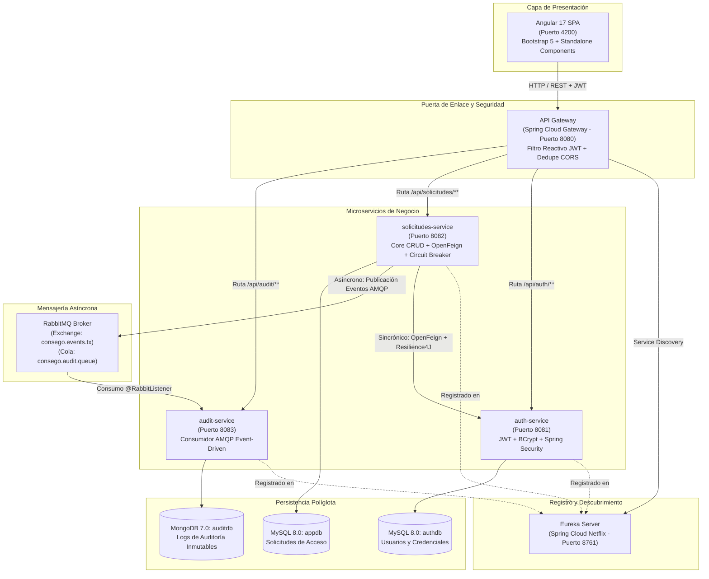

# 🛡️ CONSEGO - Sistema Distribuido de Control de Solicitudes de Acceso (v1.0)

[](https://www.oracle.com/java/)
[](https://spring.io/projects/spring-boot)
[](https://spring.io/projects/spring-cloud)
[](https://angular.dev/)
[](https://www.docker.com/)
[](https://kubernetes.io/)
[](https://www.mongodb.com/)
[](https://www.mysql.com/)
[](https://www.rabbitmq.com/)

Plataforma empresarial de microservicios para la gestión, validación sincrónica y auditoría asíncrona de solicitudes de acceso técnico a plataformas críticas (AWS Cloud, Azure Portal, GitHub Organization, Bases de Datos de Producción, VMs On-Premise).

---

## 🏛️ Arquitectura del Sistema

El ecosistema está construido bajo patrones cloud-native y principios de persistencia políglota, cumpliendo íntegramente con los requisitos del curso **Desarrollo de Servicios Web II**:



---

## 📦 Componentes y Microservicios

| Componente | Puerto | Tecnología Principal | Responsabilidad |
|---|---|---|---|
| **eureka-server** | `8761` | Spring Cloud Netflix Eureka | Registro y localización dinámica de instancias de microservicios. |
| **api-gateway** | `8080` | Spring Cloud Gateway (WebFlux) | Enrutamiento balanceado (`lb://`), validación centralizada de tokens JWT y gestión de cabeceras CORS. |
| **auth-service** | `8081` | Spring Boot, Spring Security, JPA | Gestión de usuarios, autenticación, cifrado de contraseñas con `BCryptPasswordEncoder` y generación de JWT. |
| **solicitudes-service** | `8082` | Spring Boot, Data JPA, OpenFeign, Resilience4J | Núcleo de negocio: CRUD completo de solicitudes de acceso, validación de usuarios vía Feign Client protegido con Circuit Breaker y emisión de eventos. |
| **audit-service** | `8083` | Spring Boot, Spring AMQP, Data MongoDB | Receptor asíncrono event-driven de RabbitMQ y persistencia de trazas de auditoría en MongoDB. |
| **frontend** | `4200` | Angular 17 Standalone | Interfaz de usuario reactiva para inicio de sesión, creación de solicitudes y supervisión en tiempo real. |
| **MySQL 8.0** | `3306` | MySQL Server | Almacenamiento relacional segregado en bases de datos `authdb` y `appdb`. |
| **MongoDB 7.0** | `27017` | MongoDB Community | Base de datos documental NoSQL para registros inmutables de auditoría (`auditdb`). |
| **RabbitMQ** | `5672` / `15672` | RabbitMQ Management Console | Broker de mensajería AMQP para comunicación desacoplada basada en eventos. |

---

## 👥 Usuarios de Prueba Precargados

Para facilitar las pruebas de defensa y evaluación, el sistema cuenta con usuarios iniciales (todos con contraseña `password123` cifrada con BCrypt):

| ID | Username | Contraseña | Rol Asignado | Propósito |
|:---:|:---:|:---:|:---:|:---|
| **1** | `admin` | `password123` | `Admin` | Administrador con privilegios de aprobación, rechazo y consulta global. |
| **2** | `operador` | `password123` | `Solicitante` | Usuario operador técnico que registra requerimientos de acceso. |
| **3** | `auditor` | `password123` | `Auditor` | Perfil de cumplimiento y auditoría de seguridad. |

---

## 🚀 Despliegue Rápido con Docker Compose

### Prerrequisitos
- **Docker Desktop** (con soporte para Docker Compose).
- **Node.js 18+** (opcional, solo para ejecutar el frontend fuera de Docker).

### 1. Clonar el Repositorio
```bash
git clone -b v1.0 https://github.com/CesarVerastegui/CONSEGO-MICROSERVICIOS.git
cd CONSEGO-MICROSERVICIOS
```

### 2. Levantar la Infraestructura y Microservicios
```bash
docker compose up -d --build
```

### 3. Verificar el Estado de los Contenedores
```bash
docker compose ps
```
Todos los servicios (`consego-mysql`, `consego-mongodb`, `consego-rabbitmq`, `eureka-server`, `auth-service`, `solicitudes-service`, `audit-service` y `api-gateway`) deben figurar en estado `Up` / `Healthy`.

---

## 💻 Ejecución del Frontend Angular

```bash
cd frontend
npm install
npm start
```
La aplicación web estará disponible de inmediato en **`http://localhost:4200`**.

---

## 🔗 Enlaces y Consolas de Administración

- **Frontend Angular SPA:** [http://localhost:4200](http://localhost:4200)
- **Eureka Service Registry:** [http://localhost:8761](http://localhost:8761)
- **API Gateway Entrypoint:** [http://localhost:8080](http://localhost:8080)
- **RabbitMQ Management Dashboard:** [http://localhost:15672](http://localhost:15672) *(Credenciales: `guest` / `guest`)*
- **Actuator Health Check (Gateway):** [http://localhost:8080/actuator/health](http://localhost:8080/actuator/health)

---

## 🧪 Pruebas Unitarias de Repositorio (Rúbrica Institucional)

El proyecto incluye pruebas unitarias con `@DataJpaTest` y base de datos en memoria H2 en `solicitudes-service`:

```bash
cd solicitudes-service
mvn test -Dtest=SolicitudRepositoryTest
```

Cubre al 100% las 4 operaciones requeridas por la rúbrica de evaluación:
- `testInsertarSolicitud()`
- `testActualizarSolicitud()`
- `testListarSolicitudes()`
- `testEliminarSolicitud()`

---

## ☸️ Despliegue en Kubernetes (k8s)

Los manifiestos declarativos para despliegue en clúster local (Minikube / Docker Desktop K8s) se encuentran en el directorio [`k8s/`](./k8s):
- `mysql-deployment.yaml`
- `mongodb-deployment.yaml`
- `rabbitmq-deployment.yaml`
- `eureka-deployment.yaml`
- `microservicios-deployment.yaml`

---

## 📂 Organización de Versiones

- **Rama `v1.0`:** Versión oficial y estable de la entrega final con arquitectura completa de microservicios, seguridad JWT, eventos AMQP y SPA en Angular.
- **Directorio `legacy-dsw1/`:** Respaldo histórico del desarrollo inicial del proyecto en .NET C# para fines de trazabilidad académica.
- **Directorio `docs/`:** Sílabo oficial, rúbrica de evaluación y especificación funcional del proyecto.
